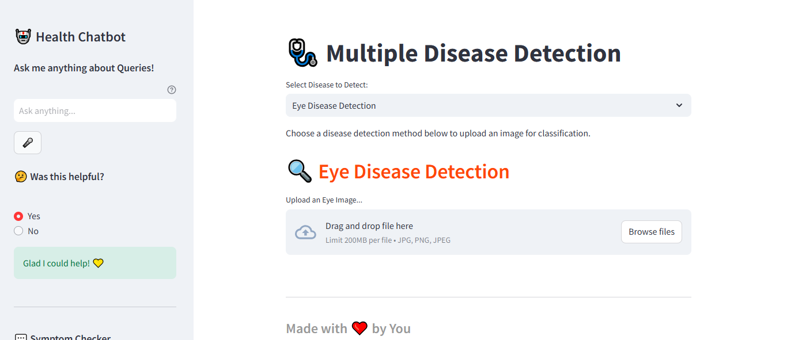
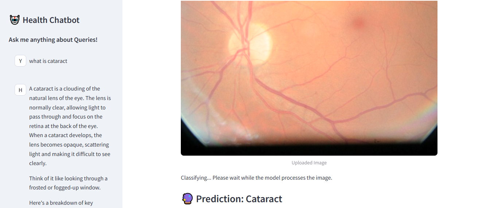

# 🩺 Multiple Disease Detection App
## 📋 Project Overview
A deep learning web application for detecting multiple diseases from medical images, built with **Python**, **TensorFlow/Keras**, and **Streamlit**.  
Empowering faster diagnosis and supporting healthcare professionals with AI.

> ⚠️ Note: Some large trained model files (`.h5`/`.pkl`) for Skin and Brain Tumor detection are **excluded** due to size constraints.

---
## 📌 Project Overview
This app brings together several disease detection models under a single, unified interface:
- 🧪 Eye Disease Detection
- 🫁 Lung Disease Classification
- 🧵 Skin Cancer Classification 
- 🧠 Brain Tumor Detection 
Upload medical images to get real-time predictions powered by convolutional neural networks.

  

---

## 🛠️ Tech Stack

- **Python 3.x**
- **TensorFlow / Keras**
- **scikit-learn**
- **Streamlit** (web UI)
- **OpenCV, NumPy, Pandas** (data handling & preprocessing)

---

## ✨ Features

✅ Unified interface to upload and detect different diseases  
✅ Multiple CNN models trained for high accuracy  
✅ Modular codebase for easy addition of new disease models  
✅ Clean & interactive UI built using **Streamlit**  
✅ Chatbot integration for user assistance
✅ Fast predictions from pre-trained deep learning models

---

## 📸 Preview

| Home Screen | Result Screen |
|:--:|:--:|
|  |  |

---

## ▶️ Watch Demo

[![Watch Demo]🎥](https://drive.google.com/file/d/1lBQFru3zjjiSypZJZ0BFJ-AK2gcB37FZ/view?usp=drive_link)  
*Click to watch a quick walkthrough of the app.*

## 🚀 Future Enhancements

- ✅ Host/download large models automatically
- ✅ Add Docker support for easy deployment
- ✅ Enhance chatbot with medical FAQs
- ✅ Improve prediction explanations (Grad-CAM, heatmaps)
- ✅ Expand to include more disease detection models

---

## 📞 Contact

If you’d like to collaborate, contribute, or have any questions:

- 📧 Email: [nsrilekya6336@gmail.com](mailto:nsrilekya6336@gmail.com)
- 💼 LinkedIn: [nadella-srilekya](https://www.linkedin.com/in/nadella-srilekya-22773922a/)
- 🌐 GitHub: [Srilekya07](https://github.com/Srilekya07)

---

> *Built to support healthcare with AI-powered early disease detection.*
